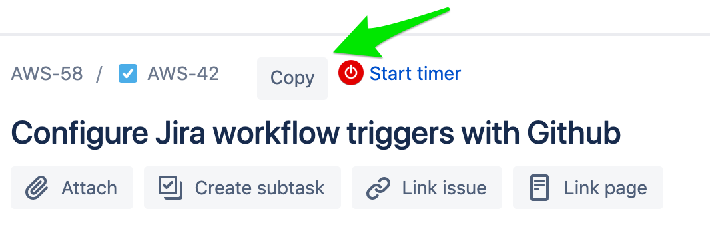

# jira-task-copy-to-clipboard-extension

Adds a `Copy` button beside task titles to copy the task id and task title.

## Example



Clicking on that `Copy` button would add this to your clipboard:  
`AWS-42 Configure Jira workflow triggers with Github`

## FAQ

### Why?

Selecting the issue id and title always inserts an endline between them, this was driving me crazy so I made a browser extension to fix this. Jira now provides a copy button in more recent versions, but it only copies issue url. I needed something else

### What's the `Start timer` in the screenshot?

See [Toggl button extension](https://github.com/toggl/toggl-button), it's quite handy :)

### Can I contribute?

Yes

## TODO

See [issues](https://github.com/GabLeRoux/jira-task-copy-to-clipboard-extension/issues)

## Development

```bash
npm i
```

```bash
npm run dev chrome
npm run dev firefox
npm run dev opera
npm run dev edge
```

## Build

```bash
npm run build chrome
npm run build firefox
npm run build opera
npm run build edge
```

## Environment

The build tool also defines a variable named `process.env.NODE_ENV` in your scripts. 

## Docs

* [webextension-toolbox](https://github.com/HaNdTriX/webextension-toolbox)

## License

[MIT](LICENSE.md) © [Gabriel Le Breton](https://gableroux.com)
